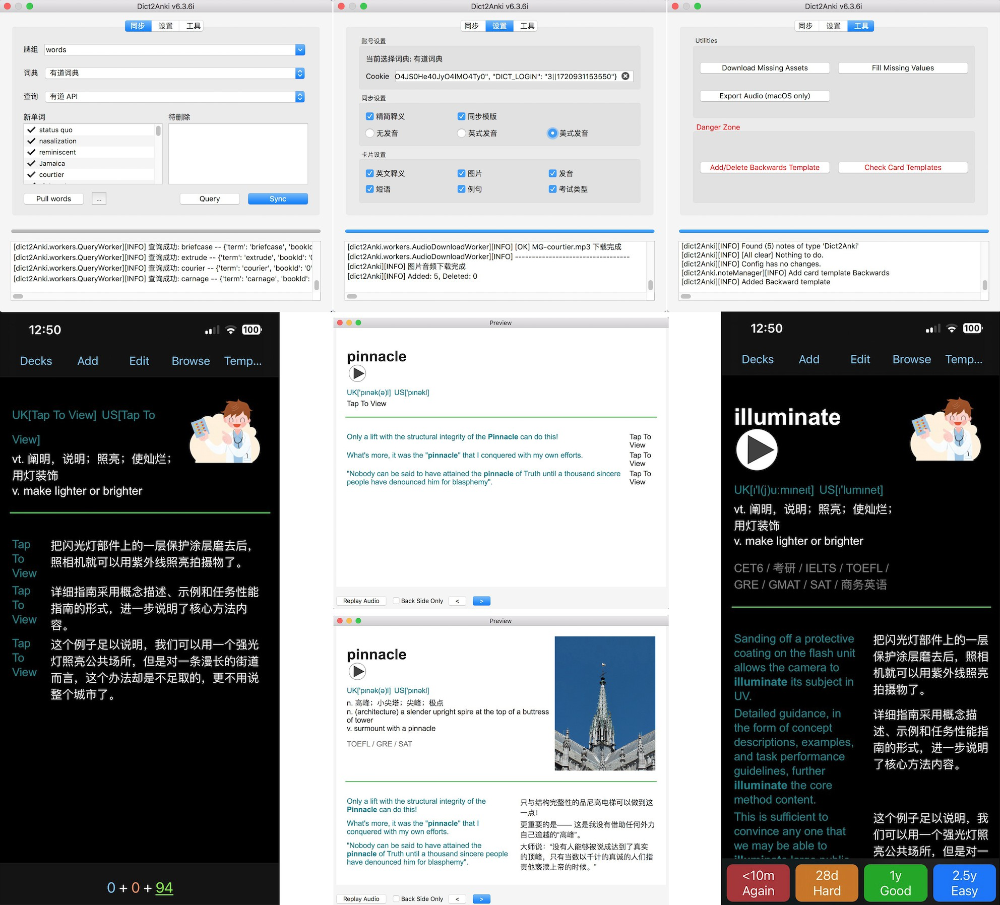

# Dict2Anki (Fork)

This is a fork of Dict2Anki.

注：当前为Fork版本，根据我的个人喜好做了一些修改。

> 插件地址：[https://ankiweb.net/shared/info/831172822](https://ankiweb.net/shared/info/831172822) 原插件地址: [https://ankiweb.net/shared/info/1284759083](https://ankiweb.net/shared/info/1284759083)

本fork所做的修改：

* 性能优化，修复已知问题
* 尽量避免删除模版或卡片。如果字段不同，自动合并；同步页默认不选中需要删除的单词。
* 添加字段：definition_en, group, exam_type, modifiedTime, sentence_speech[0-2].（目前仅限有道词典）
* 改用4.x卡片模版；支持定制卡片模版（显示或隐藏：英文释义/图片/发音/短语/例句/考试类型）
* 支持从txt文件导入单词
* 添加其他功能
    - Download Missing Assets
    - Fill Missing Values
    - Export Audio (macOS only)
    - Add/Delete Backwards Template
    - Check Card Templates

⚠️ 部分功能仍处于开发阶段。

## Qt5 vs Qt6

插件已更新，同时支持Qt5和Qt6。

## Q & A

Q: 怎么隐藏图片？

A: 在"设置"页取消勾选"图片"，下次同步（或者使用"工具"页的"Check Card Templates"）时会自动更新模版。其他可设置字段同理。（注：此功能通过更新卡片模版实现，并不会删除媒体文件，也不会删除字段或者清空其内容）

Q: Backwards Template是什么？

A: 常规背词模版是"显示英文，盖住中文"，反向背词模版则是反过来，即"显示中文，盖住英文"。反向背词可以有效提升"主动词汇"量。

Q: 每次"Pull words"都提示第一次登录或cookie失效？

A: 依次点击Anki菜单 Tools - Add-ons， 选中Dict2Anki Fork，点击右下角的 Config 按钮，点击 "Restore Defaults" - OK.

Q: 个别单词没有图片/发音？

A1: 因为你同时收藏了多个"相同"的单词。例如同步单词"apple"时，下载的图片/发音会以"apple.jpg/mp3"保存到文件，但如果你还同时收藏了"Apple"，同步时将无法创建"Apple.jpg/mp3"文件，因为[虽然Anki区分大小写，但操作系统的文件名并不区分](https://forums.ankiweb.net/t/upper-case-and-lower-case-for-filename-bug-report/485)。

A2: 另外，少数情况下，有道/欧路词典API服务异常，单词查询结果全为空值，换个时间同步即可。（恢复正常后推荐至少执行一次 Fill Missing Values 和 Download Missing Assets 避免字段值或媒体文件缺失）

## Caveats

- 不要集中在一个时间点同步大量单词，否则你的帐号（或IP）可能会被有道/欧路限制一段时间。
- 如果新版本添加了新的字段，更新插件后建议至少执行一次工具页的 Fill Missing Values。

## Preview

